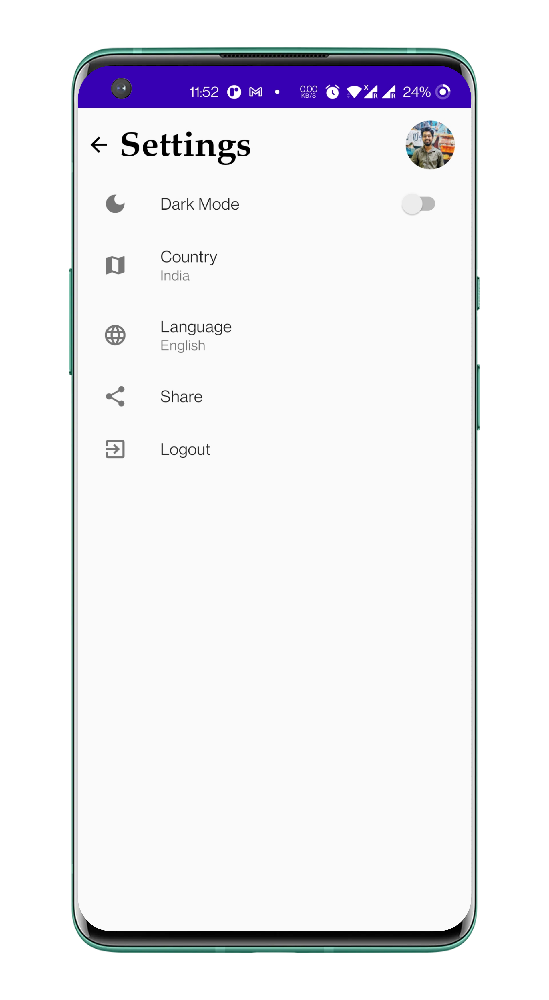

# Akhbar (News App)

## Udacity Android Developer Nanodegree Capstone Project

Akhbar is a news app that selects latest and best news from multiple national and international sources. Presents user with range of news as per their preferences.
### Features
List of main features of your app. For example:

- Saves user preferences in Firebase Realtime Database.
- Widget for recent top headlines
- Multi language support
- Support for Tab
- Search news with desired keywords.
- Shows news as per Country Preference
      
##### NOTE: 
The app uses [Newsapi](https://newsapi.org) to fetch news. In order to run the app, create account on newsapi.org and paste your api key in 
> ###### Akhbar/gradle.properties --> ApiKey="PASTE_YOUR_API_KEY_HERE"

## Preview

## Libraries Used
- [FirebaseUI](https://firebase.google.com/docs/auth/android/firebaseui) for Social Media login 
- [Firebase Realtime Database](https://firebase.google.com/docs/database/android/start) for offline and online storage
- [Glide](https://github.com/bumptech/glide) for image parsing
- [Retrofit2](https://square.github.io/retrofit/) for networking
- [Archtecture Components](https://developer.android.com/topic/libraries/architecture) (LiveData, ViewModel)
- [Lingver](https://github.com/YarikSOffice/lingver) for Internationalisation
- [Timber](https://github.com/JakeWharton/timber) for debugging/debugging

## License
Copyright [2021] [Utkarsh Deepanjan]

Licensed under the Apache License, Version 2.0 (the "License");
you may not use this file except in compliance with the License.
You may obtain a copy of the License at

    http://www.apache.org/licenses/LICENSE-2.0

Unless required by applicable law or agreed to in writing, software
distributed under the License is distributed on an "AS IS" BASIS,
WITHOUT WARRANTIES OR CONDITIONS OF ANY KIND, either express or implied.
See the License for the specific language governing permissions and
limitations under the License.
